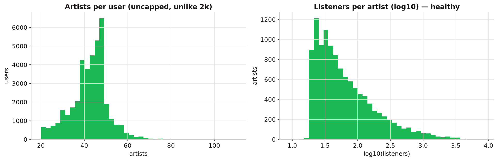
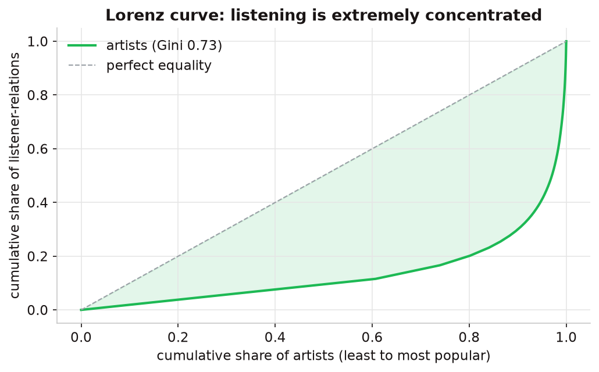
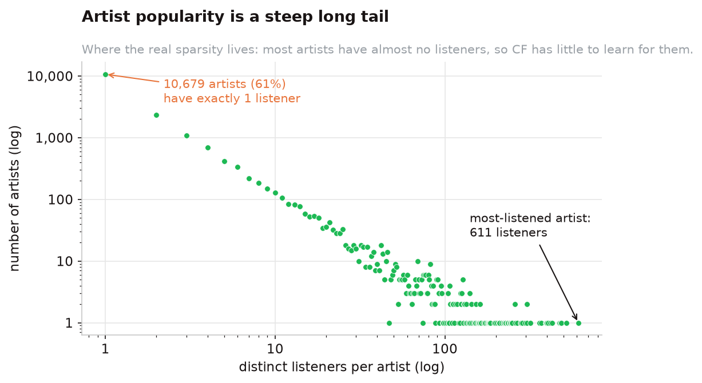

::: {.lead}
The served model is trained on **Last.fm-360K**: real, organic listening histories. Getting here
required abandoning an earlier, smaller dataset whose shape quietly distorted every result.
:::

## The served dataset — Last.fm-360K

We filter the raw dump to a *recommendable core*: users with enough history to learn from, and
artists with at least 100 distinct listeners (below which collaborative filtering has almost nothing
to work with).

::: {.kpis}
::: {.kpi}
::: {.v}
39,499
:::
::: {.l}
users
:::
:::
::: {.kpi}
::: {.v}
11,607
:::
::: {.l}
artists
:::
:::
::: {.kpi}
::: {.v}
1.68M
:::
::: {.l}
interactions
:::
:::
::: {.kpi}
::: {.v}
0.37%
:::
::: {.l}
density (99.6% sparse)
:::
:::
:::

Each user brings a **median of 44 artists** — genuine histories, not a truncated top-list. The 99.6%
sparsity is the normal regime for collaborative filtering, not an artifact.

{#fig-dist}

## The signal is implicit

The only signal is a **play count** per (user, artist) — there are no explicit ratings. Play counts
span roughly six orders of magnitude (1 to ~220,000), so treating them as graded ratings and chasing
RMSE would optimise magnitude, not preference *rank*. Instead we model them as **implicit confidence**
and evaluate with **ranking metrics**.

## Listening is extremely concentrated

A Lorenz curve of artist popularity makes the core modelling tension visible: a small set of artists
absorbs most of the listening. This is why a **popularity baseline is genuinely hard to beat**, and
why **catalog coverage** is a real product concern, not a vanity metric.

{#fig-lorenz width=80%}

::: {.callout-tip appearance="simple"}
The [live app]() recomputes all of these statistics directly from the served
matrix, so the numbers there always match the data the model is actually trained on.
:::

## Why not the small 2k set? {#the-trap}

The project began on **Last.fm-2k** (HetRec 2011): 1,892 users, 17,632 artists. It looked convenient,
but it had two structural defects that quietly distorted everything:

1. **Every user was hard-capped at their top ~50 artists.** The "sparsity" was therefore an artifact
   of truncation, not a property of real behaviour.
2. **~61% of artists had a single listener** (Gini ≈ 0.73). Those artists are near-unrecommendable —
   collaborative filtering has nothing to learn for them — which *caps achievable recall* and depresses
   every score.

{#fig-tail width=80%}

That artificial shape is precisely why we pivoted to 360K — and, as the [pivot page](pivot.qmd) shows,
why the winning model *changed* once real data arrived.
