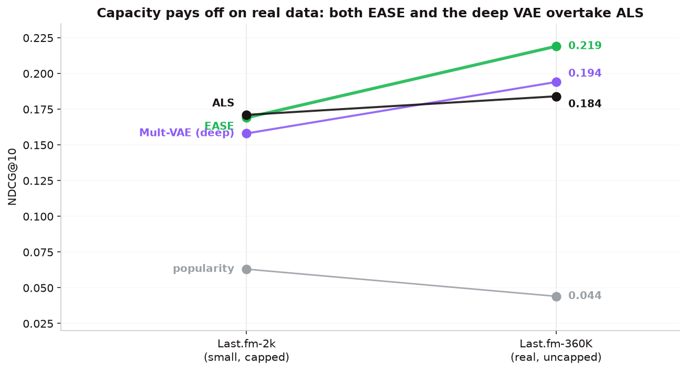

::: {.lead}
Choosing a recommender is not "pick the fanciest model." It is a *gauntlet*: run every serious candidate
— from a trivial baseline to a deep neural network — through one frozen harness, and let the numbers,
with significance tests, decide. This page is the full journey through the model space, the two models it
came down to (**EASE** and a deep **Mult-VAE**), and the honest finding at the end.
:::

## Why run a gauntlet at all {#why-gauntlet}

The instinct on a recommender project is to reach for the most powerful model available. The literature
says: don't. Ferrari Dacrema et al. ([RecSys 2019](https://arxiv.org/abs/1907.06902)) reproduced a wave of
"state-of-the-art" neural recommenders and found most were **beaten by well-tuned simple methods** that
the original papers hadn't compared against properly. Rendle et al. ([2022](https://arxiv.org/abs/2110.14037))
made the same point from the other side: a carefully-tuned classic (iALS) matches much of the neural SOTA.

The lesson we took: **the honest bar is not "beat popularity" — it is "beat the best *simple* model."**
So every candidate runs the same frozen split, the same full-catalogue ranking, and the same paired
significance test. No model gets promoted on vibes.

## The contenders {#contenders}

We benchmarked five families, spanning trivial to deep:

| Model | Family | Core idea | Why we tried it |
|-------|--------|-----------|-----------------|
| **Popularity** | non-personalised | recommend the most-listened artists to everyone | the honest floor; sparse data makes it deceptively strong |
| **item-item BM25** | neighbourhood | recommend artists co-listened with a user's history, BM25-weighted | the classic "people who listened to X also listened to Y" |
| **ALS / iALS** | matrix factorization | learn low-rank user & item vectors from implicit confidence (Hu et al. [2008](https://doi.org/10.1109/ICDM.2008.22)) | the workhorse of implicit-feedback recsys |
| **EASE** | linear autoencoder | closed-form item-item weight matrix (Steck [2019](https://arxiv.org/abs/1905.03375)) | often SOTA on sparse implicit data, no SGD |
| **Mult-VAE** | deep generative | multinomial variational autoencoder (Liang et al. [2018](https://arxiv.org/abs/1802.05814)) | the standard deep model; maximal capacity |

BPR ([Rendle 2009](https://arxiv.org/abs/1205.2618)) was also in the Phase-1 gauntlet as a pairwise-ranking
baseline. The two that mattered at the end were EASE and Mult-VAE — a linear model and a deep one — so the
rest of this page focuses on them.

## EASE, in depth {#ease}

EASE (**E**mbarrassingly **S**hallow **A**uto**E**ncoder) is deceptively simple: it learns a single
item-item weight matrix `B` such that a user's score for every artist is their listening vector times `B`.
The trick is that the optimal `B` — under a squared-error reconstruction objective with an L2 penalty and
a hard "an item can't predict itself" constraint (`diag(B) = 0`) — has a **closed form**. No gradient
descent, no epochs, no learning-rate search:

$$B = -P\,/\,\operatorname{diag}(P), \qquad P = (X^\top X + \lambda I)^{-1}, \qquad B_{ii} = 0$$

```python
def fit_ease(train, reg=100.0):
    X = (train > 0).astype(np.float32).tocsr()
    gram = np.asarray((X.T @ X).todense(), dtype=np.float32)  # item-item co-occurrence
    gram[np.diag_indices_from(gram)] += reg                   # ridge penalty
    inv = np.linalg.inv(gram)                                  # the one expensive step
    B = inv / (-np.diag(inv))                                  # closed-form solution
    B[np.diag_indices_from(B)] = 0.0                           # no self-recommendation
    return B
```

**Why it's strong.** It captures every pairwise item relationship at once (a dense `B`, unlike sparse
neighbourhood models), it has exactly one hyperparameter (`λ`), and being closed-form it is perfectly
reproducible. On sparse implicit data it is a genuine state-of-the-art contender.

**What it costs.** Inverting the item–item Gram matrix is `O(n_items³)`; at 11,607 artists that is ~a
minute and a few GB, and the resulting `B` is a dense **538 MB** matrix. It scales to tens of thousands of
items, not millions, and — being pure collaborative filtering — it uses no audio or tag features, so it
cannot help genuinely cold artists.

## The deep model, in depth {#mult-vae}

Mult-VAE is the natural "maximum capacity" challenger. It is a variational autoencoder with a
**multinomial likelihood** (the right fit for "which items did this user interact with"): an encoder
compresses a user's whole listening vector to a small latent distribution, and a decoder reconstructs a
probability over all 11,607 artists. It is trained with SGD and KL-annealing.

- **Architecture:** `11,607 → 600 → 200 (latent) → 600 → 11,607`, dropout 0.5, β-annealed KL (Liang 2018's
  recommended setup).
- **Capacity:** ~21M parameters and full non-linearity — orders of magnitude more expressive than EASE's
  single linear map.
- **The hypothesis going in:** on the tiny 2k data the deep model *lost* (too much capacity, too little
  signal). With 18× more data on 360K, capacity should finally pay off. Does it overtake EASE?

## The experiment {#experiment}

Both models — and the full zoo — ran through the **identical** protocol (`src/exp_deep_360k.py`):

- the same per-user 360K split (`test_fraction = 0.2, seed = 0`);
- **full-catalogue ranking** (all 11,607 artists, no sampled negatives);
- **accuracy** (NDCG/MAP/Recall) *and* **beyond-accuracy** (coverage, novelty, Gini) for every model;
- **paired user-level bootstrap** (5,000 resamples) for every pairwise claim.

## What we found {#results}

The deep model climbs — but does not take the crown.

| Model | NDCG\@10 | MAP\@10 | Recall\@10 | Catalog coverage | Novelty |
|-------|:--------:|:-------:|:----------:|:----------------:|:-------:|
| **EASE** (served) | **0.219** | **0.112** | **0.194** | 0.419 | 5.26 |
| Mult-VAE (deep) | 0.194 | 0.094 | 0.178 | **0.811** | **6.09** |
| ALS (128 factors) | 0.184 | 0.089 | 0.163 | 0.188 | 5.64 |
| item-item BM25 | 0.110 | 0.047 | 0.102 | 0.091 | 3.65 |
| popularity | 0.044 | 0.017 | 0.039 | 0.002 | 3.16 |

Every gap is significant (paired bootstrap, all **p < 0.001**):

::: {.callout-note appearance="simple"}
- **EASE − Mult-VAE = +0.026** NDCG\@10 — the linear model beats the deep one on accuracy.
- **Mult-VAE − ALS = +0.010** — but the deep model, properly trained, *overtakes* tuned ALS on real data.
- **EASE − ALS = +0.036**.
:::

{#fig-flip width=92%}

This is the whole arc in one chart. On the small 2k data the deep VAE *lost* to ALS. On 360K it **climbs
from last to second**. The story is not "deep learning is useless" — it is "deep learning needed the data,
and even then the well-designed linear model was better."

## The coverage question, settled {#coverage}

The most tempting intuition on this project was: *the deep model covers far more of the catalogue — surely
that means higher accuracy too?* It is worth settling with the actual numbers, because the answer is
**"right up to a point, then no."**

{#fig-frontier width=92%}

Read the curve left to right. From popularity → BM25 → ALS → EASE, coverage climbs (0.00 → 0.42) **and so
does accuracy** (0.04 → 0.22): a smarter model genuinely reaches more of the catalogue *and* ranks better.
The intuition holds in this regime. But past EASE it **turns over** — Mult-VAE nearly doubles coverage
(0.42 → 0.81) while accuracy *falls* (0.219 → 0.194).

The mechanism: every user still gets exactly 10 slots. Raising coverage means filling those slots with
**rarer** artists, and a rarer artist is relevant to fewer people — a lower-probability bet per slot. So
you cannot buy accuracy *by* forcing coverage; the causation runs the other way (a smarter model happens
to do both) only until you start trading precision for reach. **EASE sits at the sweet spot**: a healthy
42% coverage *and* the best ranking. Mult-VAE is the *discovery-oriented* alternative — the right pick if
catalogue reach matters more than top-10 precision.

## Verdict {#verdict}

- **Served model: EASE.** Best accuracy, significantly, and cheap to serve.
- **Runner-up with a job: Mult-VAE.** Not the accuracy winner, but a legitimate discovery engine (2× the
  coverage). The `diversity` (MMR) lever in the API lets a product owner slide along that frontier at
  runtime.
- **The deliverable is the process.** A frozen harness trustworthy enough to tell us the deep model was
  worth trying, that it improved with data, and *exactly* where it still fell short — with a p-value on
  every claim.

## What we deliberately did **not** do {#future}

Honest scope, and the natural next steps if this were a live product:

- **EASE variants** — EDLAE (denoising linear autoencoder), higher-order/CEASE, ADMM-SLIM. Sometimes edge
  out plain EASE by a hair; incremental.
- **RecVAE** — a stronger VAE than Mult-VAE; the fair "can a *better* deep model beat EASE?" test.
- **iALS done right** (Rendle 2022) — aggressively-tuned classic MF as the "simple, done properly" angle.
- **Hybrid / content features** — blend audio and tag signals to reach genuinely cold artists that pure CF
  cannot, the one place EASE structurally can't help.

Each is a defensible next experiment; none is likely to change the headline conclusion, which is why we
stopped at a crisp, significant result rather than an ever-growing model zoo.

## Reproducibility {#repro}

```bash
python -m src.exp_deep_360k     # EASE, ALS, Mult-VAE, popularity on the frozen 360K split
                                # -> outputs/experiments/deep_360k_results.json
```

Deterministic given seeds. Deep training un-pins the BLAS thread cap (it would be unusably slow at one
thread); everything else matches the serving path exactly.
