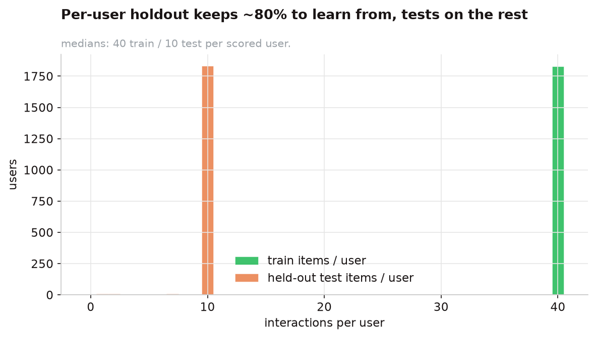
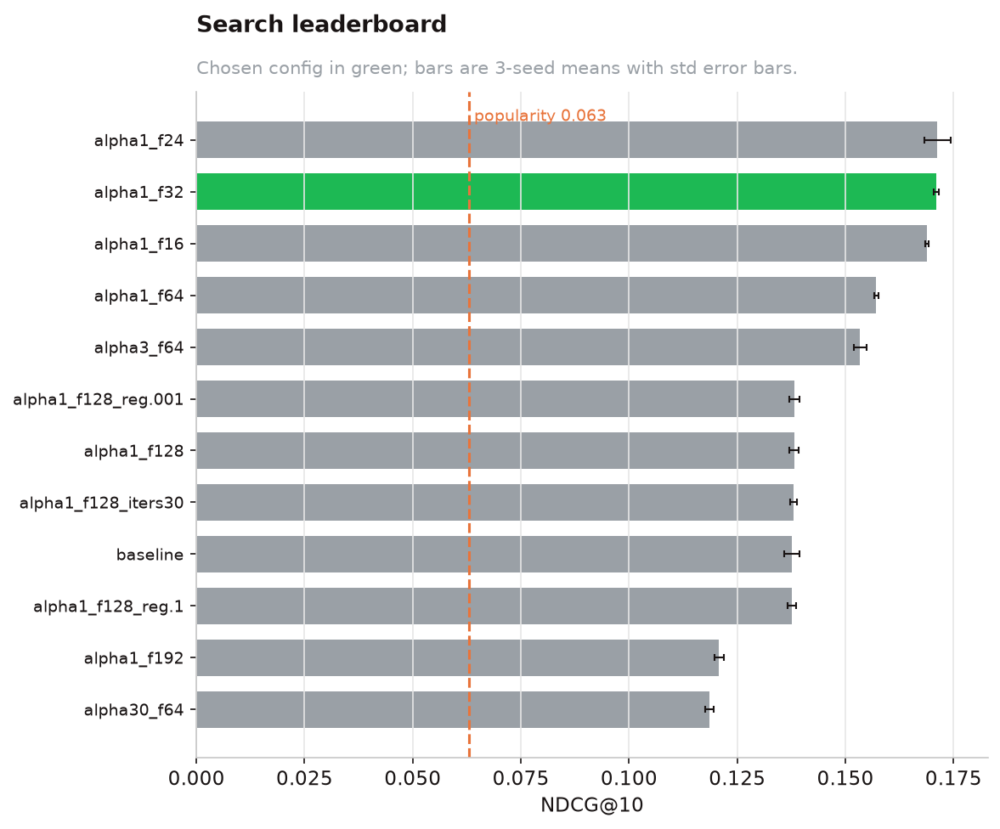
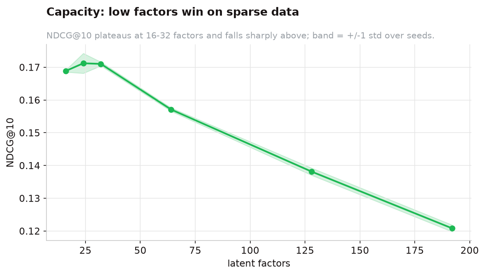
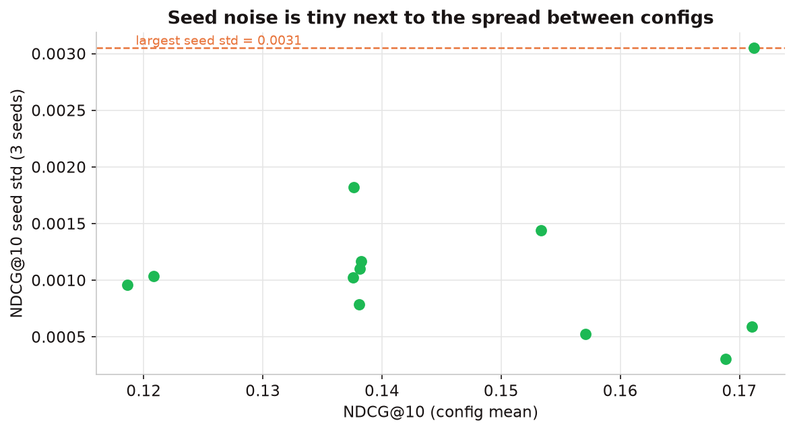

::: {.lead}
The point of this project is not a single score — it is a process that produces scores you can
*believe*. Everything below was designed so that no result depends on a lucky seed, a leaked test set,
or a weak baseline.
:::

## A frozen evaluation harness

Metrics and the data split live in a **locked `eval_core.py`** that model code never edits. This is the
autoresearch discipline (after Karpathy's autoresearch pattern): the thing being optimised against must
be immovable, or you end up tuning the ruler instead of the model.

- **Metrics:** precision\@k, recall\@k, NDCG\@k, MRR\@k, MAP\@k — all toy-validated against hand-computed
  cases in the test suite.
- **Split ownership:** the path to the sealed holdout lives in exactly one file (`make_split.py`), so no
  loop or search code even has a symbol pointing at it.

## A leakage-safe, per-user holdout

The naive approach — hold out random (user, artist) *cells* globally — leaks, because a user's own held-out
listens can inform their training profile. We instead split **within each user's history**: part trains,
part is a search-visible test set, and part is a **sealed holdout read exactly once** at the very end.

{#fig-split width=85%}

::: {.callout-important appearance="simple"}
The locked holdout was read **once**, after all model and hyperparameter decisions were final. Every
number used to *make* a decision comes from the search-visible split, never the holdout.
:::

## Full-catalogue ranking, not sampled metrics

Every model ranks **all 11,607 artists** for each user. We deliberately avoid the common shortcut of
scoring the true item against a handful of sampled negatives: Krichene & Rendle (KDD 2020) showed that
sampled metrics are not just noisier but can **re-order** which model looks best. Full ranking is more
expensive and produces smaller-looking numbers — but they are honest and comparable to the literature.

## Strong baselines, not just popularity

Following Ferrari Dacrema et al. (RecSys 2019) — who showed that many "state-of-the-art" neural
recommenders fail to beat well-tuned simple ones — every model is measured against a real gauntlet:
**popularity, ALS, BPR, item-item BM25, and a deep Mult-VAE**. Beating popularity is table stakes; the
honest bar is the best *simple* method.

## Disciplined search (Phase 1)

Hyperparameters were chosen by a pre-registered search that logs every configuration to an append-only
file and promotes nothing automatically. On the 2k data this is where we learned that **capacity was not
free** — more latent factors did not help.

::: {layout-ncol=2}
{#fig-search-lb}

{#fig-search-factors}
:::

We also verified **seed stability** — that the chosen configuration's ranking was not a fluke of one
random seed — rather than importing heavier stability machinery the data did not warrant.

{#fig-seed width=80%}

## Significance, not vibes

Every "X beats Y" claim carries a **paired, user-level bootstrap** (5,000 resamples) with a confidence
interval and a p-value (`src/stats.py`). A difference in mean NDCG is only reported as *real* when the
interval excludes zero.

## How a recommendation is generated

For the served EASE model, a single recommendation request is four steps:

1. **Look up** the user's row in the binarised interaction matrix (what they've listened to).
2. **Score** every one of the 11,607 artists in one sparse mat-vec: `scores = x · B`, where `B` is the
   learned item-item weight matrix.
3. **Mask** the artists the user has already played, so recommendations are genuinely new.
4. **Rank / diversify:** take the top-k; if `diversity > 0`, re-rank a wider pool with MMR (using ALS
   item embeddings) to trade a little accuracy for a more varied list.

Users with no usable history fall back to a **popularity recommender** — the safe cold-start path.
