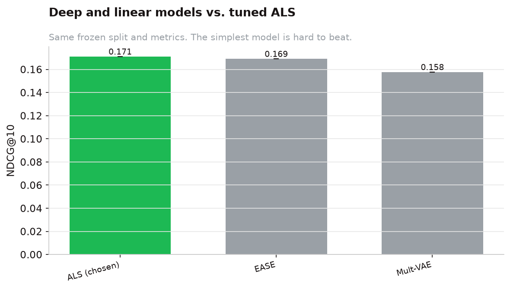

::: {.lead}
The most instructive result in this project is that the *winning model changed when the data changed*.
That is not a flaw in the method — it is the method working. Because the harness stayed frozen across
both phases, we can trust two opposite conclusions.
:::

## Phase 1 — small data (Last.fm-2k)

On the tiny, heavily-capped 2k set, we pitted a deep **Mult-VAE** and a linear **EASE** autoencoder
against a well-tuned **ALS**, all through the same frozen split and metrics.

| Model | NDCG\@10 | vs ALS |
|-------|:--------:|--------|
| **ALS (chosen)** | **0.171** | — |
| EASE | 0.169 | not significant (p = 0.41) |
| Mult-VAE (deep) | 0.158 | ALS wins, p < 0.001 |

The deep model **lost** significantly, and EASE's millions of parameters bought nothing over a small ALS.
This is exactly the Ferrari Dacrema et al. (2019) finding: on small, sparse data, complexity is not free.

{#fig-deepvs width=80%}

So in Phase 1 the served model was **ALS** (32 factors, log1p confidence) — cheaper to train, cheaper to
serve, and at least as accurate as anything more complex. Knowing *when not* to reach for deep learning
was the point.

## Phase 2 — real data (Last.fm-360K)

With 18× more interactions and real, uncapped histories, we ran the *same* comparison again. Capacity
**pays off** — and the ordering changes:

| Model | NDCG\@10 (2k) | NDCG\@10 (360K) | on 360K |
|-------|:-------------:|:---------------:|---------|
| EASE | 0.169 | **0.219** | wins |
| Mult-VAE (deep) | 0.158 | 0.194 | overtakes ALS |
| ALS | **0.171** | 0.184 | |
| popularity | 0.063 | 0.044 | |

Two things happen at once on real data. First, EASE's extra representational capacity finally has enough
signal to pay off, and it pulls **significantly ahead** of ALS (+0.036 NDCG\@10, p < 0.001) — it becomes
the served model. Second, and more surprisingly, the **deep Mult-VAE climbs from last to second**: on 2k
it lost to ALS, but on 360K it *overtakes* ALS (+0.010, p < 0.001). It still trails EASE (−0.026, p <
0.001), but the deep model went from "not worth it" to a genuine contender the moment the data was real.

{#fig-flip width=90%}

## Why this is the real story

::: {.callout-tip appearance="simple"}
**Model complexity earns its keep only once there is enough data.** The classic data-scale lesson, but
here it is *demonstrated* rather than asserted — with a frozen harness and a significance test on both
sides. The discipline is what lets us report two opposite winners without hand-waving.
:::

The practical consequence for a portfolio: the deliverable is not "I trained EASE." It is "I built an
evaluation process trustworthy enough that it told me to change my mind, and I could prove the new answer
was better."
