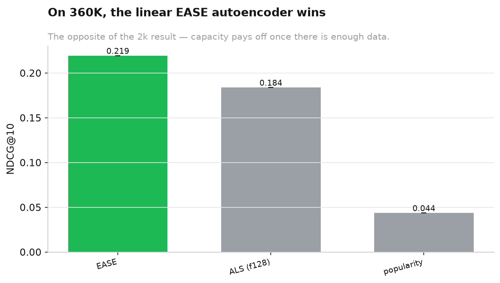
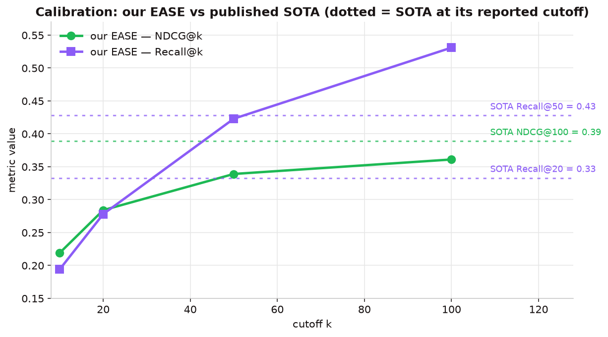
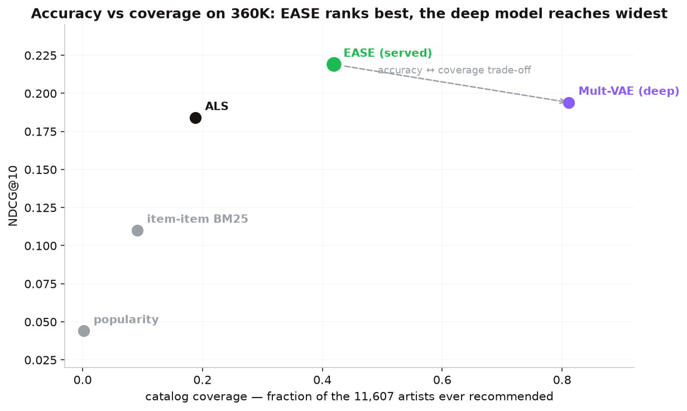

::: {.lead}
On the real 360K data, the linear **EASE** autoencoder wins the model comparison — significantly — and
its honest full-ranking numbers sit in the published state-of-the-art band. It is the served model.
:::

## The leaderboard {#leaderboard}

NDCG\@10 on the held-out Last.fm-360K split, full-catalogue ranking. Every contender ran through the
*same* frozen split and metrics; EASE was chosen because it won, not by preference.

| Model | NDCG\@10 | MAP\@10 | Recall\@10 | |
|-------|:--------:|:-------:|:----------:|---|
| **EASE** | **0.219** | **0.112** | **0.194** | [served]{.badge-served} |
| Mult-VAE (deep) | 0.194 | 0.094 | 0.178 | |
| ALS (128 factors) | 0.184 | 0.089 | 0.163 | |
| item-item BM25 | 0.110 | 0.047 | 0.102 | |
| popularity | 0.044 | 0.017 | 0.039 | |

{#fig-compare width=85%}

## The lead is significant

Paired, user-level bootstraps (5,000 resamples) on per-user NDCG\@10 confirm every margin is real, not
noise:

::: {.callout-note appearance="simple"}
- **EASE − ALS = +0.036**, 95% CI [0.034, 0.037], **p < 0.001**.
- **EASE − Mult-VAE = +0.026**, 95% CI [0.025, 0.027], **p < 0.001** — EASE beats the deep model too.
- **Mult-VAE − ALS = +0.010**, 95% CI [0.008, 0.011], **p < 0.001** — the properly-trained deep model
  *does* overtake tuned ALS on real data (see [the pivot](pivot.qmd)).
:::

## Is 0.22 low? Calibration against SOTA

NDCG\@10 reads low *only* because we rank the full catalogue at a tight cutoff. As the cutoff `k` grows,
the numbers rise into the band published for the comparable **Million Song Dataset** (MSD):

| Cutoff | Our EASE (NDCG) | Our EASE (Recall) |
|:------:|:---------------:|:-----------------:|
| \@10 | 0.219 | 0.194 |
| \@20 | 0.284 | 0.278 |
| \@50 | 0.339 | 0.423 |
| \@100 | 0.361 | 0.531 |

Published SOTA references on MSD: EASE **NDCG\@100 ≈ 0.39**, **Recall\@50 ≈ 0.43**, **Recall\@20 ≈ 0.33**.
The dotted lines below mark each SOTA value **at the cutoff where it is actually published** — so we
compare like-for-like, not a \@10 point against a \@100 line. Our curve reaches SOTA where SOTA is
reported: the "0.22\@10" that looks low is simply the tightest-cutoff view of a strong ranker.

{#fig-cutoff width=90%}

## Beyond accuracy — and the accuracy-vs-coverage frontier

Accuracy is not the whole story: a model that only ever recommends the ten most popular artists can
score respectably while being useless for discovery. So we also measure **coverage** (how much of the
catalogue is ever recommended) and **novelty** (how rare the recommended artists are), over the full
held-out set at k = 10:

| Model | NDCG\@10 | Catalog coverage | Novelty (bits) |
|-------|:--------:|:----------------:|:--------------:|
| **EASE** (served) | **0.219** | 0.419 | 5.26 |
| Mult-VAE (deep) | 0.194 | **0.811** | **6.09** |
| ALS | 0.184 | 0.188 | 5.64 |
| item-item BM25 | 0.110 | 0.091 | 3.65 |
| popularity | 0.044 | 0.002 | 3.16 |

{#fig-frontier width=90%}

This is the **accuracy-vs-discovery frontier**, and it settles a tempting intuition: more coverage does
*not* buy more accuracy. The deep **Mult-VAE covers 81% of the catalogue to EASE's 42%** — nearly double,
and it surfaces rarer artists — yet its NDCG\@10 is *lower* (0.194 vs 0.219). Pushing recommendations out
into the long tail trades top-10 precision for reach; it is a product choice, not a free win. The API
exposes a `diversity` parameter (MMR re-ranking) as the runtime lever on exactly this trade-off, rather
than hard-coding a single point on the frontier.

::: {.callout-note appearance="simple"}
**A note on the coverage number.** Coverage grows with how many users you aggregate over, so it must be
quoted against a fixed population — these figures are measured over the **entire** held-out set of
39,499 users, not a small sample.
:::

## Robustness on the locked holdout

Re-reading the sealed holdout **once**, trained on the full pool, the served configuration generalises
with no sign of overfitting — the search-visible numbers held up on data no decision ever touched.
